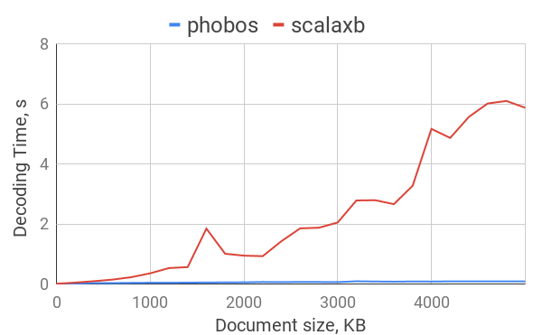
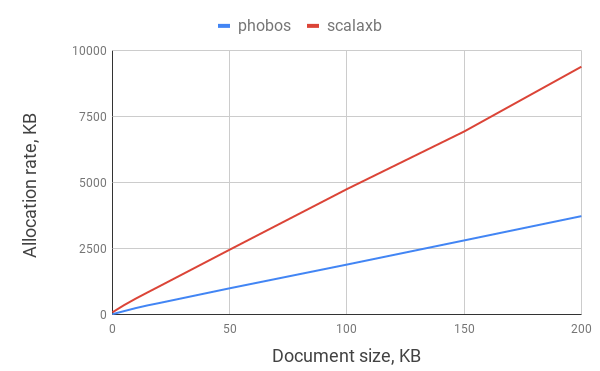

# phobos-benchmark

This project is benchmark for [phobos](https://github.com/TinkoffCreditSystems/phobos) XML library using JMH. 

For launching benchmarks type `sbt jmh:run -prof gc -rf csv` in terminal in root 
directory of the project. It will print results to terminal and save 
them in `jmh-result.csv` file. Execution of this command takes plenty of time.

Benchmarking is comparing phobos with scalaxb. 

**PurchaseOrderBenchmark** is benchmark measuring performance of decoding PurchaseOrder 
XML document. Schema of this document is placed in the `/src/main/xsd/po/po.xsd` file. 
You can see example of such document below.
```xml
<?xml version='1.0' encoding='UTF-8'?>
<purchaseOrder orderDate="1999-10-20">
    <shipTo country="US">
        <name>Alice Smith</name>
        <street>123 Marple Street</street>
        <city>Mill Valley</city>
        <state>CA</state>
        <zip>90952</zip>
    </shipTo>
    <billTo country="US">
        <name>Robert Smith</name>
        <street>8 Oak Avenue</street>
        <city>Old Town</city>
        <state>PA</state>
        <zip>95819</zip>
    </billTo>
    <comment>Hurry, my lawn is going wild!</comment>
    <items>
        <item partNum="QEKkaHedxFt8UPdis">
            <productName>9DprI</productName>
            <quantity>-235701016</quantity>
            <USPrice>0.529541179615654</USPrice>
            <comment></comment>
            <shipDate>InwnoUVd5MulLm8Amez</shipDate>
        </item>
        <item partNum="d32JMv3hF9">
            <productName>WKEcI</productName>
            <quantity>2094590288</quantity>
            <USPrice>0.9758509262748334</USPrice>
            <comment>qhGeEJad</comment>
            <shipDate>ij</shipDate>
        </item>
    </items>
</purchaseOrder>
```
Benchmark consists of several decoding runs with different sizes of `items` list. 
Single benchmark name looks like `benchmarking.PurchaseOrderBenchmark.{L}{N}`, 
where `{L}` is library name (either phobos or scalaxb) and `{N}` is size of `items` list. 
Each item adds 200B in average to documents.

Properties measured are  
*time per operation* (`benchmarking.SimpleTest.{L}{N}`) in operation per second and 
*allocation rate* (`benchmarking.SimpleTest.{L}{N}:·gc.alloc.rate.norm`) in 
bytes per operation.

### Results for version `0.0.1`
Results of benchmarking are saved in `results` directory.


